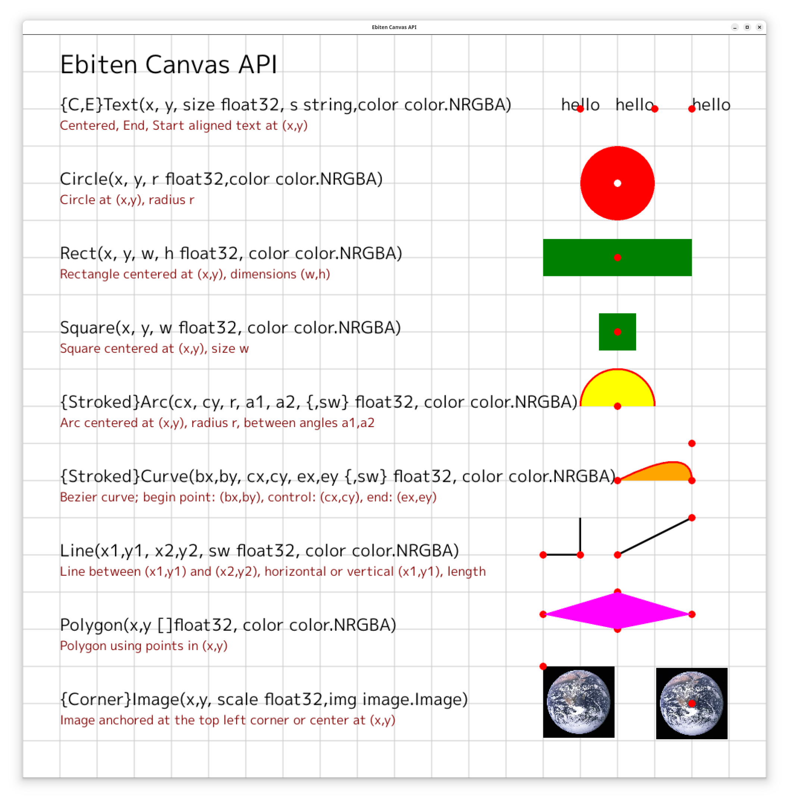
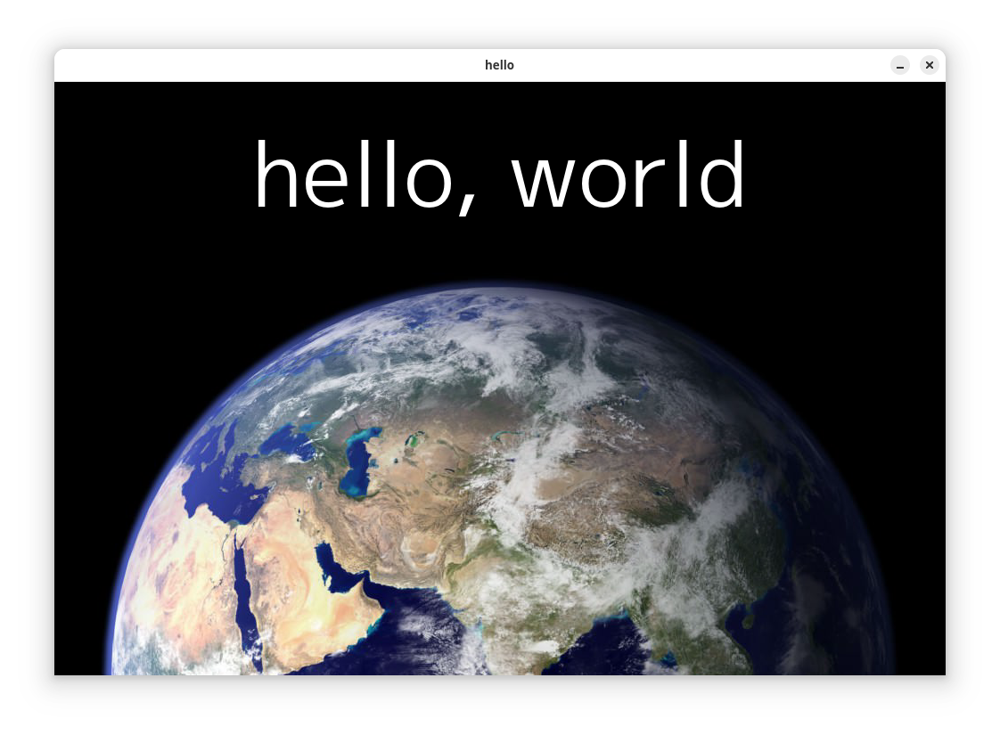

# ebcanvas -- a 2D canvas API built on ebitenengine


# Introduction

ebcanvas draws text, shapes, and images on a ebiten screen.  Most methods are on the struct ```Canvas```:

	type Canvas struct {
		Width int
		Height int
		Screen *ebiten.Image
	}

All coordinates are percentages ranging from 0-100 with the origin at the lower left, with x increasing to the right and y increasing up.
Measures such as text size, stroke widths and image scales are also percents of the canvas width.

This code:
```
var earth image.Image
var screenWidth = 1000
var screenHeight = 666

func hello(screen *ebiten.Image) {
        canvas := new(ebcanvas.Canvas)
        canvas.Screen = screen
        canvas.Width = screenWidth
        canvas.Height = screenHeight

        bgcolor := color.RGBA{0, 0, 0, 255}
        txcolor := color.RGBA{255, 255, 255, 255}

        canvas.Background(bgcolor)
        canvas.Image(50, 0, 100, earth)
        canvas.CText(50, 80, 10, "hello, world", txcolor)
}

func main() {
        ebiten.SetWindowSize(screenWidth, screenHeight)
        ebiten.SetWindowTitle("hello")

        if err := loadimage("earth.jpg"); err != nil {
                fmt.Fprintf(os.Stderr, "%v\n", err)
                return
        }
        if err := ebcanvas.LoadFont(); err != nil {
                fmt.Fprintf(os.Stderr, "%v\n", err)
                return
        }
        if err := ebiten.RunGame(&App{}); err != nil {
                fmt.Fprintf(os.Stderr, "%v\n", err)
                return
        }
}
```

Makes


# Text

Text anchored at (x,y)

	(c *Canvas) Text(x, y, size float32, s string, textcolor color.RGBA)```

Text centered at (x,y) 

	(c *Canvas) CText(x, y, size float32, s string, textcolor color.RGBA)```

Text whose end is at (x,y) 

	(c *Canvas) EText(x, y, size float32, s string, textcolor color.RGBA)```

# Images

CenterImage places an image centered at (x,y) at the specified scale (0-100)

	(c *Canvas) Image(x, y float32, scale float32, img image.Image) 

CornerImage places an image with the upper left corner at (x,y) t the specified scale (0-100)

	(c *Canvas) CornerImage(x, y float32, scale float64, img image.Image)

# Shapes

Arc draws an filled arc centered at (cx,cy) with radius r, between angle a1 and a2

	(c *Canvas) Arc(cx, cy, r, a1, a2 float32, fillcolor color.RGBA)

StrokedArc draws an filled arc centered at (cx,cy) with radius r, between angle a1 and a2

	(c *Canvas) StrokedArc(cx, cy, r, a1, a2, size float32, strokecolor color.RGBA)

Rect draws a filled rectangle centered at (x,y) with dimensions (w,h)

	(c *Canvas) Rect(x, y, w, h float32, fillcolor color.RGBA)

Circle draws a filled circle centered at (x,y), with radius r

	(c *Canvas) Circle(cx, cy, r float32, fillcolor color.RGBA)

Draw horizontal and vertical lines with stroke width sw, beginning at (x,y), for length size. 

	(c *Canvas) HLine(x1, y1, size, sw float32, strokecolor color.RGBA)
	(c *Canvas) VLine(x1, y1, size, sw float32, strokecolor color.RGBA)

Draw a line with stroke width sw, beginning at (x1,y1) and ending at (x2,y2)

	(c *Canvas) Line(x1, y1, x2, y2, sw float32, strokecolor color.RGBA)

Draw a filled polygon using points in x and y

	(c *Canvas) Polygon(x, y []float32, fillcolor color.RGBA)

Draw filled and stroked quadradic Bezier curves, starting at (x1,y1), ending at (x3,y3), with control point at (x2,y2)

	(c *Canvas) Curve(x1, y1, x2, y2, x3, y3 float32, fillcolor color RGBA) 
	(c *Canvas) StrokedCurve(x1, y1, x2, y2, x3, y3, size float32, strokecolor color.RGBA) 

Square draws a square centered at (x,y) at the specified size.

	(c *Canvas) Square(x, y, size float32, fillcolor color.RGBA)

# Convenience methods

LoadFont loads the default font (found in the example/resources directoryof the ebiten package.

	LoadFont()

Fill the canvas with a background color

	(c *Canvas) Background(fillcolor color.RGBA)

Grid draws a grid starting at (x,y), dimensions at (w,h),
A gridline is drawn at the specifed interval.

	(c *Canvas) Grid(x, y, w, h, size, interval float32, strokecolor color.RGBA)

PolarDegrees returns the Cartesian coordinates (x, y) from polar coordinates, with compensation for canvas aspect ratio

	(c *Canvas) PolarDegrees(cx, cy, r, theta float32) (float32, float32)

Polar returns the Cartesian coordinates (x, y) from polar coordinates
with compensation for canvas aspect ratio

	(c *Canvas) Polar(cx, cy, r, theta float32) (float32, float32)

Coord shows the specified coordinate, using percentage-based coordinates
the (x, y) label is above the point, with a label below.

	(c *Canvas) Coord(x, y, size float32, s string, fillcolor color.RGBA) 

ColorLookup returns the color using strings in the form of:

* SVG color names: (like "red" or "magenta")
* RGB: "rgb(r)", "rgb(r,b)", "rgb(r,g,b)", "rgb(r,g,b,a)", for example "rgb(128,200,70)"
* Hex: #rr", "#rrgg", "#rrggbb", "#rrggbbaa, for example, "#AA00AA"
* HSV: "hsv(hue, sat, value)", for example, "hsv(0,0,100)"

```ColorLookup(s string) color.RGBA```

MapRange maps a value between low1 and high1, return the corresponding value between low2 and high2

	MapRange(value, low1, high1, low2, high2 float64) float64


