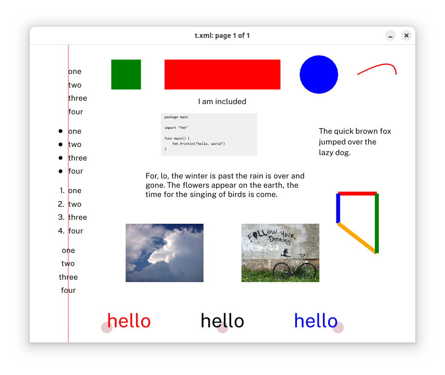

# ebdeck -- deck client



ebdeck reads deck markup from a named file or standard input and renders it.
If the file changes, ebdeck will refresh the display.

```ebdeck f.xml # read from a deck file```

```ebdeck < f.xml # read from standard input```

```decksh f.dsh | ebdeck  # convert a dsh file, show it```

# interaction

* Q or Esc: Quit
* R: refresh
* Home: show first slide
* End: show last slide
* Down Arrow, Left Arrow, Page Down: previous slide
* Up Arrow, Right Arrow, Page Up: next slide
* [ : grid on
* ] : grid off

# command line options
```
  -fontdir string
        directory for fonts (default "$DECKFONTS/deckfonts")
  -grid float
        grid size (0 for no grid)
  -layers string
        Layer order (default "image:rect:ellipse:curve:arc:line:poly:text:list")
  -mono string
        mono font (default "Inconsolata-Medium")
  -pages string
        page range (first-last) (default "1-1000000")
  -pagesize string
        pagesize: w,h, or one of: Letter, Legal, Tabloid, A3, A4, A5, ArchA, 4R, Index, Widescreen (default "Letter")
  -sans string
        sans font (default "PublicSans-Regular")
  -serif string
        sans font (default "Charter-Regular")
  -symbol string
        sans font (default "ZapfDingbats")
```

