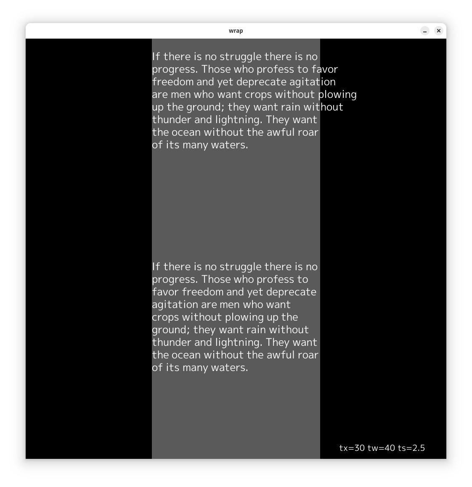
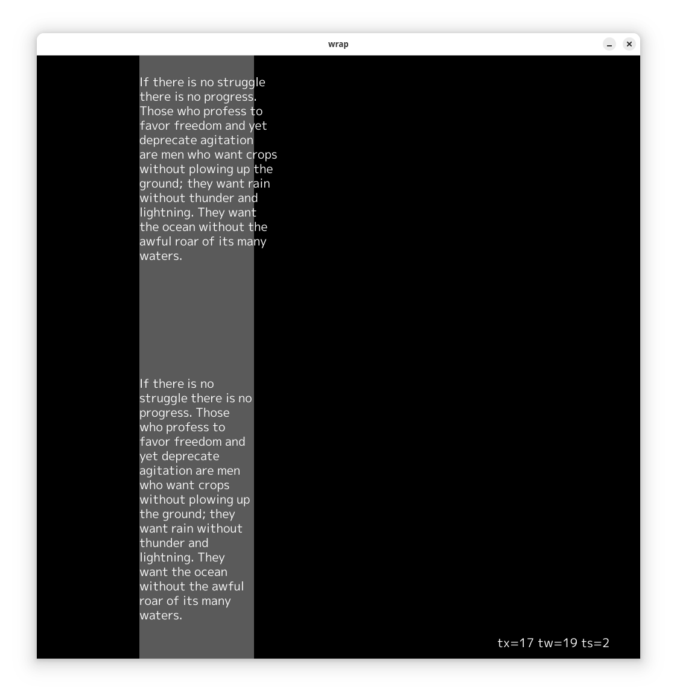

# wrap: demonstrate text wrapping

show the TextWrap and TextWrapScript functions.

# interaction

* Home Key: set inital values of left margin, width, and text size
* PgUp: increate text size by 0.5%
* PgDn: decrease text size by 0.5%
* Right Arrow: increase left margin by 1%
* Left Arrow: decrease left margin by 1%
* Arrow Up, Left Mouse: increase width by 1%
* Arrow Down, Right Mouse: decrease width by 1%
